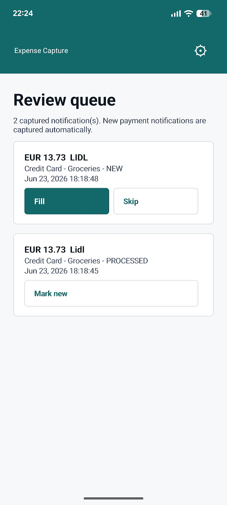
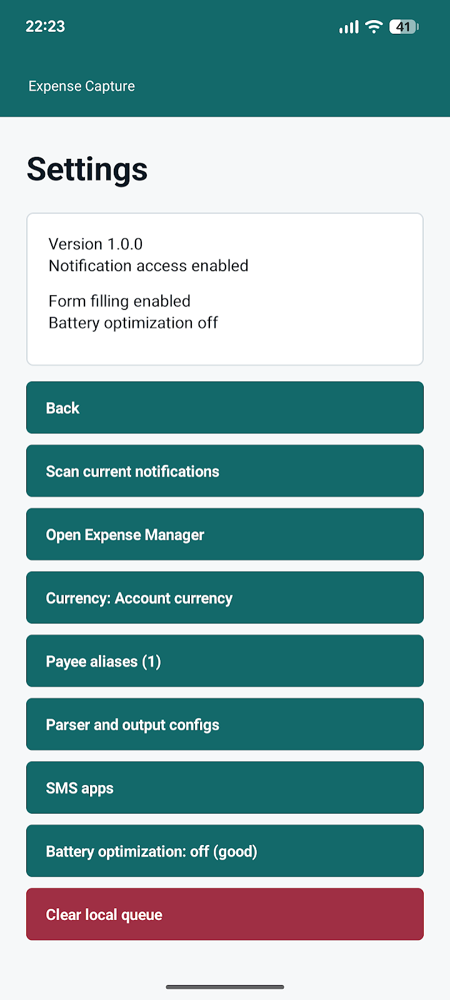
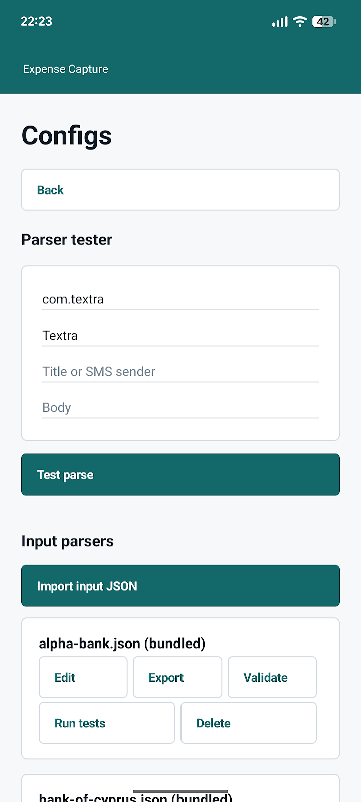
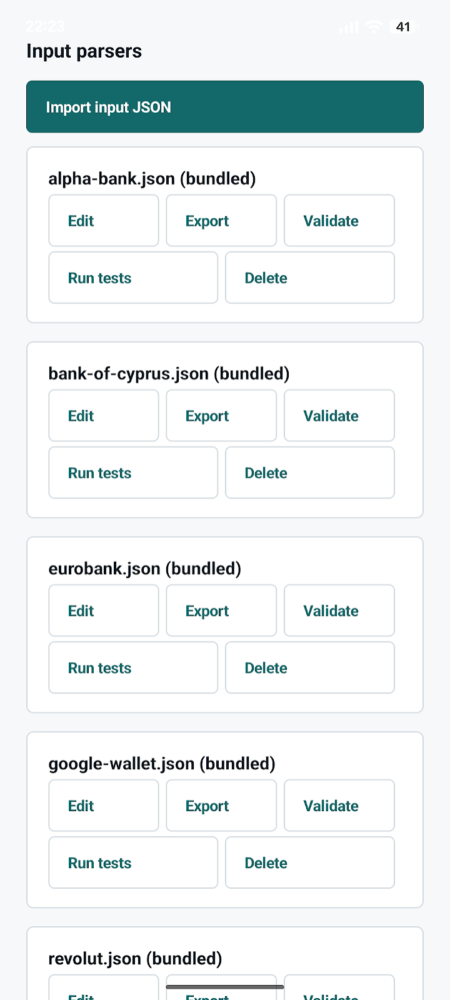
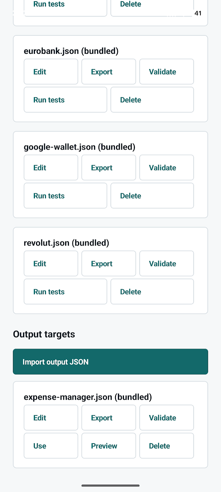

# Expense Notification Helper

Small Android helper for turning payment notifications into draft expense entries.

> Install by sideloading the APK from GitHub Releases. Updates can be installed manually from new releases or tracked with Obtainium using this repository's GitHub Releases.

The main app lives in `android_app/` and is installed as:

```text
dev.fanis.expensenotification
```

It is designed to keep your expense app as the system of record while removing most of the manual typing.

## Screenshots

| Review queue | Settings |
| --- | --- |
|  |  |

| Config editor | Input parsers |
| --- | --- |
|  |  |

| Output targets |
| --- |
|  |

## What It Does

- Reads active payment notifications through Android notification access.
- Watches configured notification packages and SMS senders from editable JSON input-source files.
- Ships default input configs for Revolut, Google Wallet, Alpha Bank, Bank of Cyprus, and Eurobank Cyprus.
- Parses likely expense candidates: amount, currency, merchant/payee, source app, payment method, timestamp.
- Defaults card payments to the **Credit Card** payment method, but keeps a friendly Google Wallet card nickname from notifications like `€40.00 with Travel Card` when one is present.
- Stores candidates locally on the phone.
- Shows a review queue.
- Opens the configured output app. The bundled output target is Bishinews Expense Manager, and additional expense apps can be added with output JSON profiles.
- Uses intent extras and optional Accessibility field ids from the active output profile to fill amount, payee/merchant, description, payment method, category, and date when the target app supports those fields.
- Pre-types the merchant into the target app's payee autocomplete so you can pick your saved payee from the dropdown, then learns that merchant -> payee choice and prefills it next time. Manage learned mappings from the **Payee aliases** screen, which also has a **Blocked merchants** list for platforms like Wolt or Bolt where the real payee changes every time and should never be auto-mapped.

The helper does not press the target app's final OK/save button. You still review the entry before saving.

## Parser And Output Configs

Open **Settings > Parser and output configs** to inspect or edit the JSON files the app uses.

- Input parser files live under `inputs/*.json`. Bundled defaults are read from app assets, and edits/imports are saved as user overrides in app storage by filename.
- Output target files live under `outputs/*.json`. Imported output targets can be selected with **Use**.
- Multiple expense apps are supported when the target app exposes an Activity that can be opened by explicit package/activity name and can accept the needed values through intent extras and/or stable view ids that Accessibility can fill.
- **Parser tester** lets you paste a package/app/title/body and see the candidate produced by the active config, including the source/rule diagnostics.
- **Validate** checks JSON schema basics, regex compilation, required parser groups, output profile fields, and embedded parser tests.
- **Run tests** executes the sample notifications embedded in each parser config.
- **Preview** shows the target package/activity, intent extras, and Accessibility ids for an output profile.
- Export writes the current JSON file through Android's document picker. Delete removes only a user override; bundled defaults remain available.

See [docs/config-schema.md](docs/config-schema.md) and `examples/` for parser/output config templates.

### Adding An Output Target

1. Create an output JSON file from `examples/outputs/example-output.json`.
2. Set `package` and `activity` to the target expense app's add-transaction Activity.
3. Map the target app's intent extra names under `extras`.
4. Add Accessibility view ids under `fields` when the app does not accept a value by intent extra or needs an autocomplete field filled after launch.
5. Import it from **Settings > Parser and output configs > Import output JSON**.
6. Tap **Validate**, then **Preview** to confirm the package/activity, extras, and field ids.
7. Tap **Use** to make it the active output target.

If the target app does not expose a usable Activity, blocks external launches, has no useful intent extras, and has unstable or inaccessible field ids, it is not a good output target for this helper.

## SMS Apps

For bank SMS parsing, the bank sender is the notification title, but the notification package belongs to the SMS app. Open **Settings > SMS apps** to add the SMS app you use.

- **Detect SMS apps** finds the default SMS app and installed apps that handle `sms:` / `smsto:` links, then asks you to confirm which ones to add.
- **Add installed app** lets you choose another app manually if detection misses it.
- Bundled defaults remain active, and confirmed custom SMS apps are merged into the parser at runtime.

## Workflow

1. Enable notification access.
2. Payment notifications are captured into the queue automatically as they arrive.
3. Open **Expense Notification Helper**.
4. Review captured candidates.
5. Tap **Fill**.
6. Review the entry in the target expense app and save it there.

Use **Scan current notifications** only as a backfill for notifications that are still active, for example right after enabling notification access or if the listener was disconnected.

When **Fill** is tapped, the candidate is marked `PROCESSED` in the helper queue.

Use **Skip** for duplicates or non-expense notifications. Card actions are state-aware: `NEW` items show **Fill** and **Skip**, skipped items show only **Unskip**, and processed items show only **Mark new** so they can be returned to `NEW`.

## Install

1. Download the latest `ExpenseCapture-v*.apk` from [GitHub Releases](https://github.com/fanis/expense-notification/releases).
2. Open the APK on your Android device and allow installation from your browser or file manager when prompted.
3. Open **Expense Notification Helper**.
4. Enable **Notification access** and **Accessibility / form filling** from the setup buttons.
5. If Android blocks either toggle, follow **Sideloaded install: Allow restricted settings** below.

### Updates With Obtainium

To receive update checks through Obtainium:

1. Add app.
2. Choose **GitHub** as the source.
3. Use repository URL `https://github.com/fanis/expense-notification`.
4. Set release asset matching to APK files, for example `ExpenseCapture-.*\.apk`.
5. Install updates from Obtainium when a new GitHub Release is published.

## Setup

The app needs two Android permissions enabled manually:

- **Notification access**: allows the helper to read current payment notifications.
- **Accessibility / form filling**: allows the helper to fill target app fields.

The app only shows setup buttons when either permission is missing.

### Sideloaded install: Allow restricted settings

On Android 13 and later, sensitive settings may be blocked when the APK was installed from a browser or file manager, including downloads from GitHub Releases. Notification access and Accessibility may appear greyed out with a "Restricted setting", "Restricted access", or "App was denied access" message.

To unlock them after installing the GitHub release APK, use the app's **Open app info** setup button or open app info manually:

1. Settings > Apps > Expense Notification Helper.
2. Tap the three-dot menu, **More**, or the equivalent app-info menu for your Android build.
3. Tap **Allow restricted settings**.
4. Re-open Notification access and Accessibility and enable the toggles.

This is a standard Android 13+ security gate, but the exact Settings labels differ between Google Pixel, Samsung, OnePlus, Xiaomi, Huawei/Honor, and other Android builds. The app can show generic Android 13+ guidance and open its own App info page, but Android does not provide a reliable app API for detecting the exact manufacturer-specific Settings route or whether the restricted-settings gate is currently active.

This is usually a per-install gate, not per-update: subsequent upgrades from a same-signed APK keep the permissions intact and do not re-trigger the dialog. Installing through `adb install` from a connected laptop often avoids the gate because adb is treated as a trusted installation source.

## Releases

Signed APKs are published through GitHub Releases from version tags like `v1.0.0`.
Local and GitHub Actions release builds use the same private signing key, which is not stored in git.

Use `bash scripts/release.sh <patch|minor|major> --push` to bump the Android version, tag, and push a release. Update docs before running the script, then check the GitHub Actions release build.

The installed app shows its version in **Settings**.

## Limitations

- Android notification listeners capture new notifications while access is enabled. Manual scan can only read notifications that are still active; it cannot recover dismissed notification history.
- Category and payee autofill depend on what the active output app exposes. For Expense Manager, the helper pre-types the merchant to open the payee dropdown; you pick the entry, and it remembers your choice for that merchant.
- This app is meant to be installed by sideloading from GitHub Releases. It is not published on Google Play.

## Provenance

This Android app was authored by Fanis Hatzidakis (https://fanis.dev) with assistance from large-language-model tooling (OpenAI Codex and Claude Code). All code was reviewed, tested, and adapted by Fanis.

## License

Copyright (c) 2026 Fanis Hatzidakis (https://fanis.dev).

Licensed under the MIT License. See [LICENSE](LICENSE).

## Repository Layout

```text
android_app/        Android helper app
```

See [BUILD.md](BUILD.md) for build and install commands.
